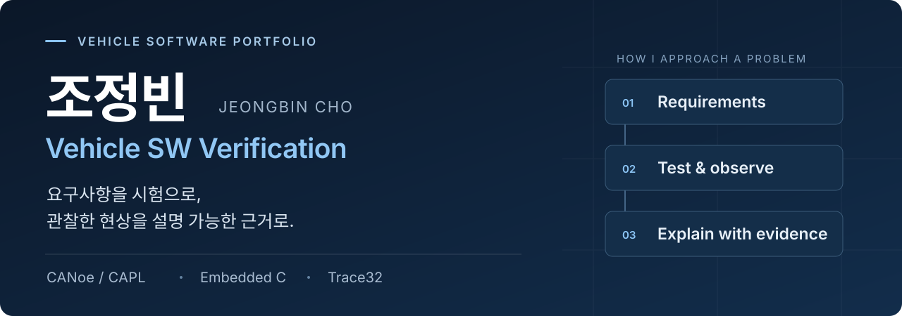
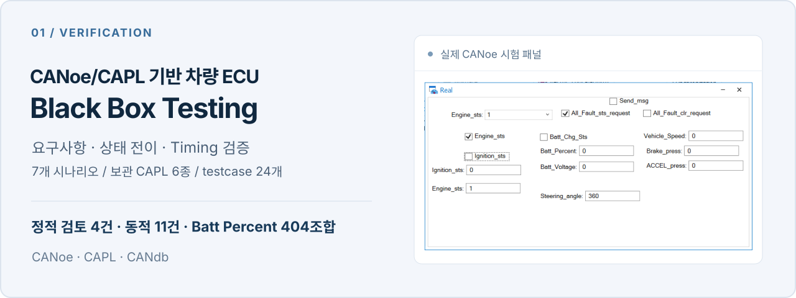
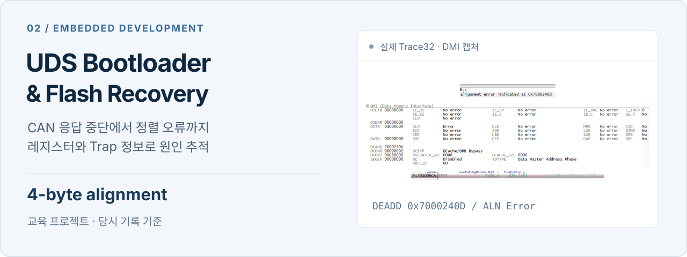
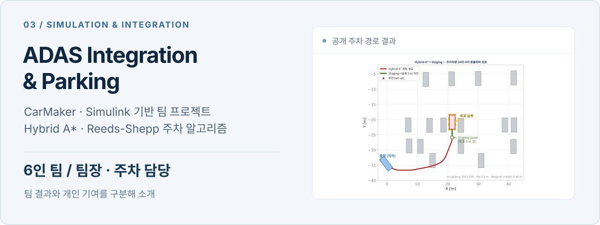

**[PORTFOLIO ↗](https://jb-cho55.github.io/portfolio/)** &nbsp; · &nbsp; [프로젝트 근거 자료](https://jb-cho55.github.io/portfolio/#projects) &nbsp; · &nbsp; [EMAIL](mailto:cho.jeongbin55@gmail.com)

차량 소프트웨어 검증을 준비하는 **조정빈**입니다. 요구사양을 테스트 조건과 판정 기준으로 전환하고, CANoe 기반 수동 검증과 CAPL 자동 검증, Trace 분석으로 결함을 재현하고 원인을 추적합니다.

 

## Selected work

**CANoe/CAPL 기반 차량 ECU Black Box Testing · 개인 프로젝트 · 우수상** 
요구사양을 기준으로 Fault 상태 전이, 선행 조건, 타이밍 등을 검증했습니다. 요구사양 7개 고장 시나리오를 CAPL 스크립트 6종·테스트케이스 24개로 구현하고, Batt Percent 시나리오 404조합을 시험했습니다. 정적 결함 4건과 동적 결함 11건을 식별했으며, Steering Timing은 요구사양 50±10ms 대비 실제 986~993ms에 검출됐습니다. 수동 검증과 CAPL 자동 검증 결과 차이를 CAN Trace로 분석해 최신 Frame 수신 후 타이머가 동작하도록 CAPL 로직을 개선했습니다.

[시험 설계와 실행 근거 ↗](https://jb-cho55.github.io/portfolio/artifacts/black-box/)

 

**UDS를 통한 Flash Backup & Restore · 개인 교육 프로젝트** 
AURIX TC234LP 교육 환경에서 UDS 기반 ECU Reprogramming과 Application Backup/Restore를 구현했습니다. Application Erase 중 CAN 응답 중단을 Trace32로 추적해 source buffer의 4바이트 Alignment 위반을 원인으로 특정·수정했습니다.

> 당시 실행·재검증 기록과 현재 정적 확인을 구분합니다. 이후 발견한 길이·권한 검사 및 valid pattern 기록 순서의 개선안은 **미적용·미검증** 상태이며, 모든 오류·중단 상황에서 안전한 부팅을 보장하는 구현으로 제시하지 않습니다.

[구현과 디버깅 과정 ↗](https://jb-cho55.github.io/portfolio/artifacts/bootloader/) &nbsp; · &nbsp; [시험 판정·근거·한계](https://jb-cho55.github.io/portfolio/artifacts/bootloader/#test)

 

**CarMaker ADAS 통합·주차 · 6인 팀의 팀장 / 주차 알고리즘 담당** 
CarMaker·Simulink 기반 ADAS 통합 프로젝트에서 Hybrid A*·Reeds-Shepp를 적용한 주차 알고리즘을 담당했습니다. 팀 전체 결과와 개인 기여를 구분해 소개합니다.

[코드와 프로젝트 문서 ↗](https://github.com/jb-cho55/IVS-CarMaker-ADAS)

 

## Toolkit

**시험 설계·자동화** 
CANoe · CAPL · CANdb · 경계값 · 동등분할 · 상태 전이 테스트

**개발·디버깅** 
Embedded C · AURIX TC234LP · CAN / ISO-TP / UDS · Trace32 · MCAL 기반 Flash 제어

**교육·실습** 
AUTOSAR Classic / MCAL · A-SPICE · ISO 26262 · MISRA C · Polyspace

[프로젝트별 기술 경험 수준 ↗](https://jb-cho55.github.io/portfolio/#skills)

 

## Background

**국민대학교 자동차IT융합학과** 졸업 
HL만도·HL클레무브 **Intelligent Vehicle School 5기** 수료 · 812시간

**ISTQB CTFL · 정보처리기사** 
Black Box Testing 프로젝트 우수상 · IVS 5기 모범상

[자격·수상 증빙 ↗](https://jb-cho55.github.io/portfolio/#credentials)

 

**More projects** &nbsp; [보안 CAN 차량 네트워크](https://github.com/jb-cho55/Autonomous-Computing-Platform-FinalProject) &nbsp; · &nbsp; [DeepRacer 캡스톤](https://github.com/jb-cho55/Capstone_DeepRacer_KOOKNET_2025) 
**Contact** &nbsp; [cho.jeongbin55@gmail.com](mailto:cho.jeongbin55@gmail.com)
